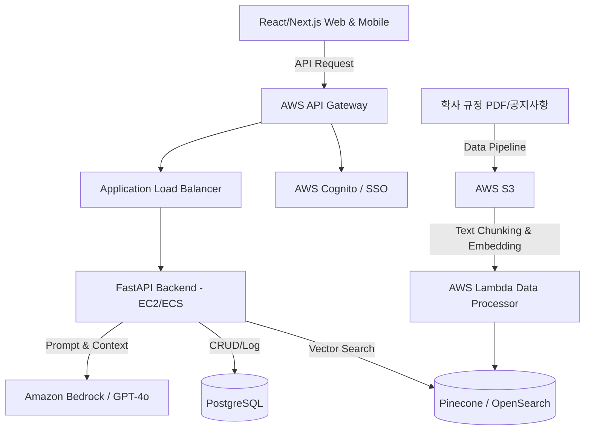

# 🎓 AI 학사 행정 프로젝트: 마스터 개발 가이드

본 문서에서는 학생들의 복잡한 학사 규정, 일정, 절차를 쉽고 빠르게 해결하는 **'AI 학사 행정 비서'** 구축을 위한 마스터 설계 가이드라인을 제시합니다.

---

## 1. 시스템 아키텍처 (System Architecture)

전체 시스템은 보안성과 확장성을 고려하여 AWS 기반의 완전 관리형 서비스와 유연한 FastAPI, 반응형 프론트엔드로 구성됩니다.



### 아키텍처 핵심 요약:
* **Frontend**: React 또는 Next.js로 PWA(Progressive Web App)를 구축하여 모바일 및 웹 접근성 극대화. 다국어 지원(i18n) 내장.
* **Backend**: Python FastAPI를 활용해 비동기 요청 처리 최적화 (채팅 응답 지연 최소화).
* **AI / RAG**: 문서는 S3에 적재 후 Lambda를 통해 임베딩을 거쳐 Pinecone(또는 AWS OpenSearch)에 적재. 사용자 질의 시 빠르고 정확하게 컨텍스트를 검색하여 LLM(Bedrock/GPT-4o)에 주입.

---

## 2. 데이터베이스 설계 (ERD & Schema)
> **참고:** 자세한 테이블 명세서는 [db_tables.md](./db_tables.md) 파일에 별도 작성되었습니다.

* **`users`**: 기본 사용자 정보 (학번, 이름, 소속, 선택 언어)
* **`chat_sessions` & `chat_messages`**: 사용자 대화 세션 및 질의응답 히스토리 로깅 (기억 유지 및 추후 파인튜닝/분석용)
* **`schedules`**: 사용자별 맞춤 달력 및 주요 학사 일정
* **`forms`**: AI가 자동 생성한 폼 데이터(휴복학, 자퇴, 장학금 신청 등)의 상태 관리
* **`document_metadata`**: RAG에 쓰이는 원본 문서(규정, 공지 등)에 대한 메타 정보

---

## 3. RAG (Retrieval-Augmented Generation) 로직 구현

정확성(Hallucination 방지)이 생명인 학사 규칙 정보를 다루므로 검색의 품질이 가장 중요합니다.

### Step 1. Data Ingestion (데이터 적재 및 임베딩)
1. **PDF 파싱**: PyMuPDF(`fitz`) 등을 이용해 표, 메타데이터 손실 없이 학사 규정 텍스트 추출.
2. **Chunking**: `RecursiveCharacterTextSplitter` (LangChain)
   * `chunk_size`: 800~1000 characters
   * `chunk_overlap`: 150~200 characters (문맥 단절 방지)
3. **메타데이터 추가**: 각 Chunk에 `source`, `page_number`, `category(장학, 수강, 졸업 등)`, `target_major` 부여.
4. **Vector DB 적재**: Embedding 모델(text-embedding-3-small 또는 AWS Titan)을 통해 Vector 화 후 Pinecone 에 저장.

### Step 2. Retrieval (의도 파악 및 검색)
1. **Query Rewriting (질의 재구성)**:
   * 유저의 입력이 짧을 경우("나 전과하고 싶어"), 사용자의 프로필(2학년, 컴공과)을 결합하여 질의를 구체화: "컴퓨터공학과 2학년 학생의 전과 조건 및 절차".
2. **Hybrid Search**:
   * 단순 유사도 검색(Dense) + 키워드 검색(Sparse/BM25)을 결합해 규정명이나 조항 번호 검색 정확도 향상.

### Step 3. Generation (답변 생성)
프롬프트 파이프라인에서 검색된 문맥(Context)을 아래 프롬프트에 주입하여 답변을 생성합니다.

**시스템 프롬프트 (페르소나)**:
```text
당신은 대학교의 친절하고 전문적인 AI 학사 행정 상담원입니다.
반드시 아래 제공된 [문서 컨텍스트]만을 바탕으로 사용자의 [질문]에 답변하세요.
문서에 없는 내용은 절대 지어내지 말고, "해당 내용은 현재 학사 규정에서 확인할 수 없습니다. 행정실에 문의해주세요."라고 안내하세요.
답변 시 항상 정보의 출처(규정집 제N조, 공지사항 제목 등)를 명시하고, 이해하기 쉽도록 단계별 리스트(1,2,3...)로 작성하세요.
사용자의 언어 설정에 맞춰 번역하여 응답하세요.

[문서 컨텍스트]
{context}

[질문]
{query}
```

---

## 4. API 명세서 (FastAPI 기준)

| Method | Endpoint | 설명 | Request Body / Query | Response |
|---|---|---|---|---|
| `POST` | `/api/v1/auth/login` | SSO / 로그인 | `{"student_id": "...", "password": "..."}` | `{"access_token": "...", "user_id": "..."}` |
| `POST` | `/api/v1/chat/ask` | 메인 RAG 채팅 질의 | `{"session_id": "UUID", "message": "전과 조건이 뭐야?"}` | `{"reply": "...", "sources": [{"title": "학칙 제20조", "url": "..."}]}` |
| `GET` | `/api/v1/users/{id}/schedules` | 개인/공통 학사 일정 조회 | `?month=2024-05` | `{"schedules": [{ "date": "...", "title": "..." }]}` |
| `POST` | `/api/v1/forms/generate` | 서류 초안 AI 자동 생성 | `{"form_type": "leave_of_absence", "reason": "군입대"}` | `{"form_id": "...", "status": "draft", "preview_json": {...}}` |

---

## 5. 핵심 단계별 개발 마일스톤 (Milestones)

### Phase 1: MVP 환경 구축 (Weeks 1-2)
* FastAPI 초기 세팅 및 DB 설계/마이그레이션 적용.
* 아주 기초적인 규정 PDF 1~2개로 LangChain + Pinecone RAG 파이프라인 구축 및 질의응답 테스트.

### Phase 2: 데이터 파이프라인 및 백엔드 고도화 (Weeks 3-4)
* 전체 학사 규정 및 공지사항 크롤러 작성 및 Vector DB 구성 자동화 배치 구현.
* Hybrid Search 도입 및 프롬프트 엔지니어링 수행. (정확도 확보)
* 기초 `chat/ask` API 및 일정, 서류 자동 생성 API 로직 구현.

### Phase 3: 프론트엔드 연동 및 시스템 통합 (Weeks 5-6)
* React / Next.js 초기 화면, 채팅 UI 개발.
* 다국어 설정(Locale)을 프론트/백에 적용해 번역된 응답이 정상 반환되는지 확인.
* JWT 기반 권한 인증 및 세션 통신 연동.

### Phase 4: 테스트, 피드백 및 배포 (Weeks 7-8)
* QA 봇 테스트 (엣지 케이스: 모호한 질문, 학칙 예외 케이스 질문 등 점검).
* AWS EC2/ECS/S3 등 프로덕션 환경 구축 및 CI/CD(Github Actions) 파이프라인 세팅.
* 서비스 정식 런칭 및 모니터링 체계 확립.
